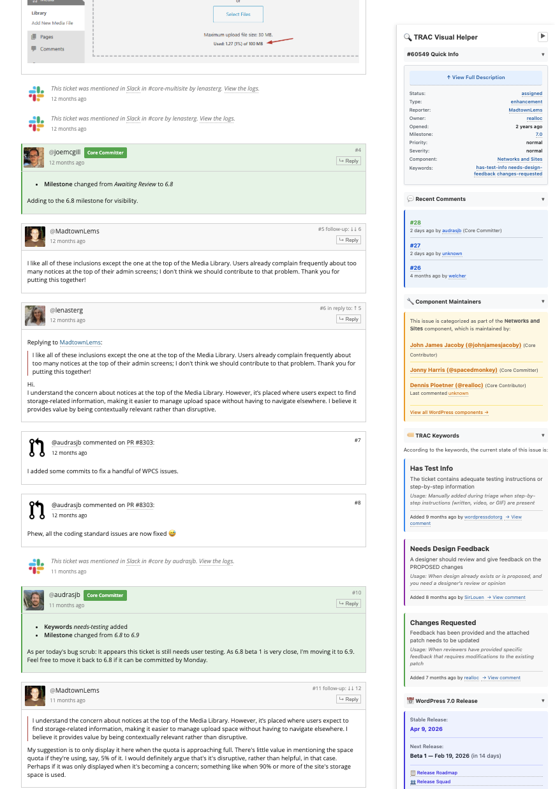

# WP Trac Triager

[](https://opensource.org/licenses/MIT) [](https://chrome.google.com/webstore) [](CHANGELOG.md)

A Chrome extension that enhances the WordPress Trac ticket triage workflow with visual highlights, keyword explanations, and component maintainer information. Perfect for WordPress contributors who want to streamline their triage process and better understand ticket context at a glance.

## Features

### 🎨 Comment Highlighting
- **Core Committers** - Blue border with lightning bolt badge
- **Component Maintainers** - Green border with wrench badge
- **Lead Testers** - Purple border with test tube badge
- **Ticket Reporter** - Orange border with document badge

### 📚 Keyword Sidebar
Floating sidebar showing explanations for all Trac keywords on the current ticket:
- Color-coded by category (Patch, Testing, Feedback, Design, Documentation, Review)
- Critical keywords marked with special badge
- Based on official WordPress Core Handbook

### 🔧 Component Maintainer Info
- Shows component maintainers near the Component field
- Links to maintainer WordPress.org profiles
- Indicates when maintainers have commented on the ticket

## Screenshots



## Installation

### From Chrome Web Store (Recommended)

*Coming soon - Extension pending review*

Once published, you can install directly from the [Chrome Web Store](https://chrome.google.com/webstore).

### Manual Installation (Development)

1. Clone or download this repository:
   ```bash
   git clone https://github.com/yourusername/wp-trac-triager.git
   cd wp-trac-triager
   ```

2. Open Chrome and navigate to `chrome://extensions/`

3. Enable "Developer mode" toggle in the top right

4. Click "Load unpacked" button

5. Select the `wp-trac-triager` folder

6. The extension is now installed and ready to use!

### For Edge Users

This extension is compatible with Microsoft Edge (Chromium-based):
1. Follow the same steps above
2. Navigate to `edge://extensions/` instead

## Usage

1. Visit any WordPress Trac ticket (e.g., https://core.trac.wordpress.org/ticket/8905)
2. The extension automatically:
   - Highlights comments from important contributors
   - Shows a keyword explanation sidebar (on the right)
   - Displays component maintainer information

## Configuration

Click the extension icon and select "Open Settings" to:
- Enable/disable individual features
- Add custom users to highlight lists
- Customize behavior

## Project Structure

```
wp-trac-triager/
├── manifest.json           # Chrome extension manifest (V3)
├── content/
│   ├── triage-helper.js   # Main content script
│   └── styles.css         # Extension styles
├── data/
│   ├── keyword-data.js    # Trac keyword definitions
│   └── maintainers-data.js # Component maintainer info
├── options/
│   ├── options.html       # Settings page
│   └── options.js         # Settings logic
├── popup/
│   ├── popup.html         # Extension popup
│   └── popup.js           # Popup logic
└── icons/
    ├── icon16.png         # Required: 16x16 icon
    ├── icon48.png         # Required: 48x48 icon
    └── icon128.png        # Required: 128x128 icon
```

## Icons Setup

**⚠️ REQUIRED: Add extension icons before loading**

Create three PNG icons and place them in the `icons/` folder:
- `icon16.png` - 16x16 pixels
- `icon48.png` - 48x48 pixels
- `icon128.png` - 128x128 pixels

**Design suggestion:** Use the WordPress logo with a wrench/tool overlay, or a Trac ticket icon.

You can use tools like:
- [Figma](https://figma.com) for design
- [RealFaviconGenerator](https://realfavicongenerator.net/) for icon generation
- [Canva](https://canva.com) for quick mockups

## Data Updates

### Updating Component Maintainers

Edit `data/maintainers-data.js`:

1. Visit https://make.wordpress.org/core/components/
2. Update the `COMPONENT_MAINTAINERS` object
3. Add new maintainers to `MAINTAINER_PROFILES`
4. Add core committers to `CORE_COMMITTERS` array
5. Update `LEAD_TESTERS` array as needed

### Updating Keywords

Edit `data/keyword-data.js` based on https://make.wordpress.org/core/handbook/contribute/trac/keywords/

## Technical Details

- **Manifest Version:** V3
- **Permissions:** `storage` (for saving settings)
- **Host Permissions:**
  - `https://core.trac.wordpress.org/*`
  - `https://meta.trac.wordpress.org/*`
- **Content Script Injection:** Runs on `/ticket/*` pages only

## Browser Compatibility

- ✅ Chrome (tested)
- ✅ Edge (Chromium-based, should work)
- ❌ Firefox (requires Manifest V2 adaptation)
- ❌ Safari (requires different extension format)

## Roadmap

See [CHANGELOG.md](CHANGELOG.md) for version history and upcoming features.

### Planned for v2.0

- Quick triage action buttons
- Keyboard shortcuts for common actions
- Dark mode support
- Ticket health score indicator
- Template comments for common responses

### Under Consideration

- Export triage statistics
- Integration with make.wordpress.org profiles
- Highlight patch attachments vs other files
- Firefox and Safari support

## Development

### Setup

```bash
# Clone repository
git clone https://github.com/yourusername/wp-trac-triager.git
cd wp-trac-triager

# Install dev dependencies (optional, for linting)
npm install

# Load extension in Chrome
# 1. Go to chrome://extensions/
# 2. Enable Developer Mode
# 3. Click "Load unpacked"
# 4. Select this directory
```

### Code Quality

```bash
# Lint JavaScript
npm run lint

# Fix linting issues
npm run lint:fix

# Format code
npm run format

# Check formatting
npm run format:check
```

### Project Structure

```
wp-trac-triager/
├── manifest.json           # Extension manifest (MV3)
├── content/
│   ├── test-simple.js     # Main content script
│   ├── page-inject.js     # Page context script
│   ├── styles.css         # Extension styles
│   └── modules/           # Modular code (for future builds)
├── data/
│   ├── keyword-data.js    # TRAC keyword definitions
│   └── maintainers-data.js # Component maintainers
├── options/
│   ├── options.html       # Settings page
│   └── options.js         # Settings logic
├── popup/
│   ├── popup.html         # Extension popup
│   └── popup.js           # Popup logic
└── icons/                 # Extension icons
```

## Contributing

We welcome contributions! See [CONTRIBUTING.md](CONTRIBUTING.md) for guidelines.

### Quick Start

1. Fork the repository
2. Create a feature branch (`git checkout -b feature/amazing-feature`)
3. Make your changes
4. Test thoroughly
5. Commit your changes (`git commit -m 'Add amazing feature'`)
6. Push to branch (`git push origin feature/amazing-feature`)
7. Open a Pull Request

## Resources

- [WordPress Trac Keywords Handbook](https://make.wordpress.org/core/handbook/contribute/trac/keywords/)
- [WordPress Components](https://make.wordpress.org/core/components/)
- [WordPress Core Handbook](https://make.wordpress.org/core/handbook/)

## Support

- **Issues**: [GitHub Issues](https://github.com/yourusername/wp-trac-triager/issues)
- **Discussions**: [GitHub Discussions](https://github.com/yourusername/wp-trac-triager/discussions)
- **Email**: your.email@example.com

## License

[MIT License](LICENSE) - Free to use, modify, and distribute.

## Credits

Built with ❤️ by [Juan Manuel Garrido](https://github.com/yourusername) for the WordPress community.

### Data Sources

- [WordPress Core Contributors Handbook](https://make.wordpress.org/core/handbook/)
- [WordPress Trac Keywords Guide](https://make.wordpress.org/core/handbook/contribute/trac/keywords/)
- [WordPress Components](https://make.wordpress.org/core/components/)

### Acknowledgments

Thanks to all WordPress core contributors and maintainers who make Trac triage possible.

---

**Made for WordPress Contributors** 🌟

If this extension helps your workflow, please star the repo and share it with fellow contributors!
